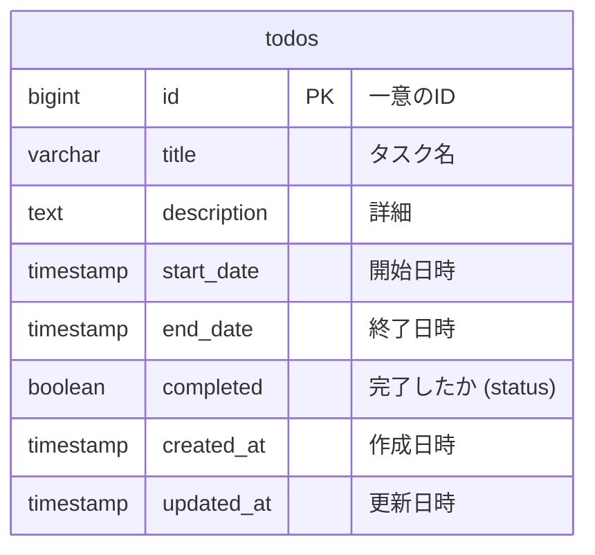
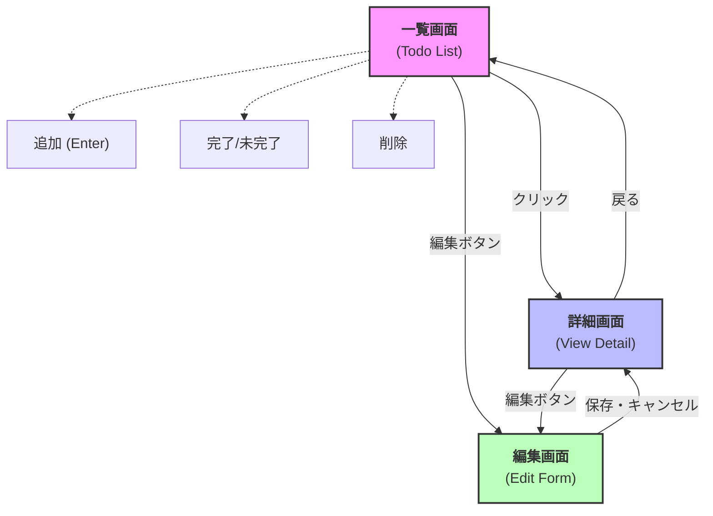

# 設計書

## 1. ER図

## 2. 画面遷移図

### 画面詳細
| メソッド | エンドポイント | 機能 |
|----------|---------------|------|
| `GET` | `/api/todos` | Todo一覧取得 |
| `GET` | `/api/todos/:id` | 特定のTodo取得 |
| `POST` | `/api/todos` | 新規Todo作成 |
| `PUT` | `/api/todos/:id` | Todo更新 |
| `DELETE` | `/api/todos/:id` | Todo削除 |
