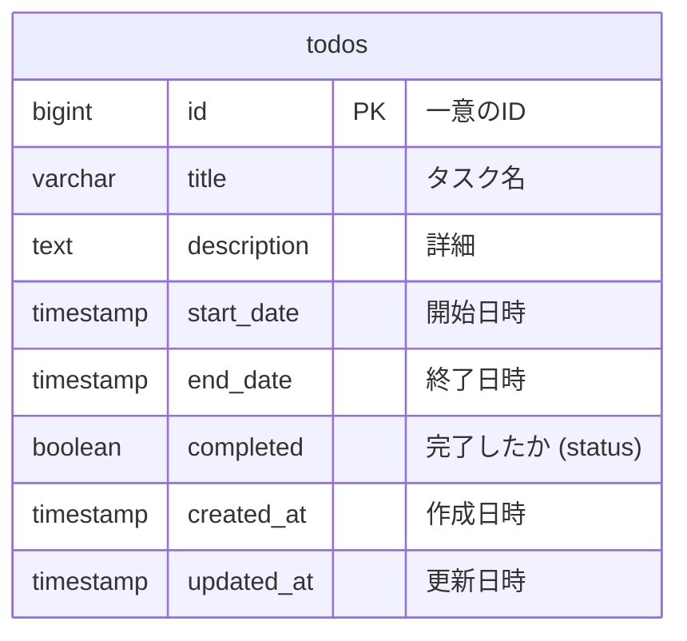
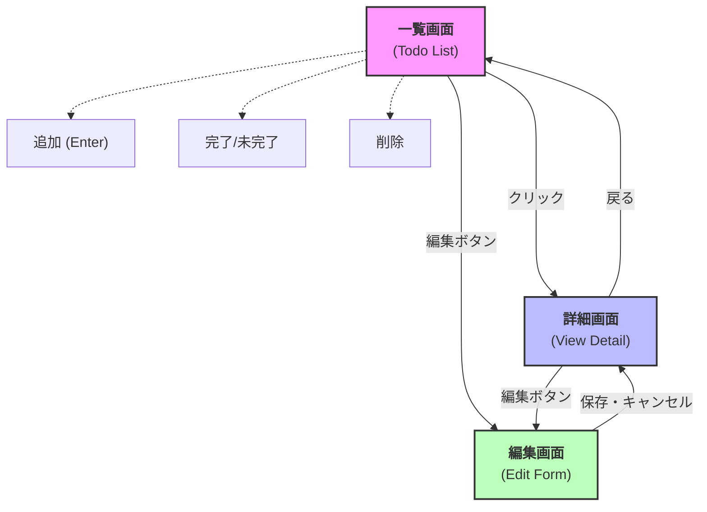

# 設計書

## 1. ER図

## 2. 画面遷移図

### 画面詳細

| 画面名 | パス (例) | 機能概要 |
| :--- | :--- | :--- |
| **一覧画面** | `/` | Todoの一覧表示、新規作成（クイック追加）、完了切り替え、削除 |
| **詳細画面** | `/todos/:id` | Todoの全ての情報（詳細、期間など）を表示 |
| **編集画面** | `/todos/:id/edit` | タイトル、詳細、開始・終了日時の編集 |
